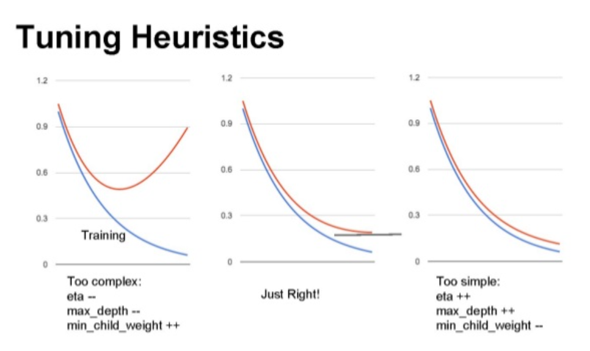
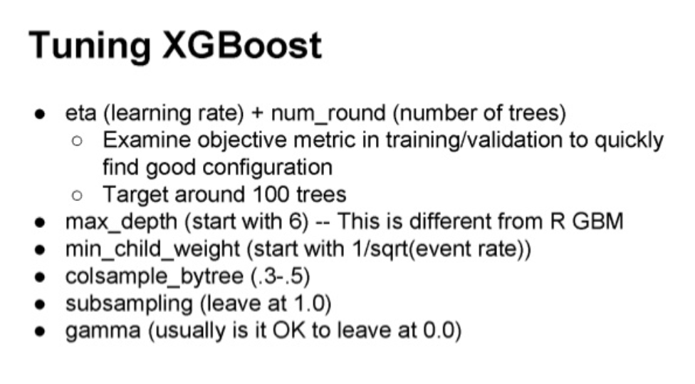

# Machine learning project

## Project structure

```
projetML
│   README.md
│   projetdatascience.rda    # dataset initial
│
└───data_processed
│   │   projetDataBase.Rda  # dataset utilisé dans les algorithmes
│   │
│   └───csvformat
│       │   projetTrainProcessed.csv
│       │   ...
│   
└───data_processing
│   │   Data Cleaning and expanding.ipynb # script R en jupyternotebook ou je traite "projetdatascience.rda" pour generer "data_processed/projetDataBase.rda"
│   │   Data_Cleaning_and_expanding.r     # script R executable sur R studio
│   │   Exploration data python.ipynb     # essai d'exploration de données à l'aide de python
│
└───gbm
│   │  GBM_clean.ipynb # script R en jupyternotebook qui utilise les données pour decrire un modele et genere "validation_results.csv"
│   │  GBM_clean.r     # script R executable sur R studio
│   │  gbm.model.Rdata # sauvegarde du model calculé
│   │  validation_results.csv # fichier reponse du set de validation
...
```

La structure des fichiers gbm,glmnet,randomforest,rpart et xgboost est la même, on retrouve :
* un .ipynb qui à l'avantage de bien structurer le code et de montrer les output de chaque morceaux de code (on peut voir l'auc, la cross validation etc.)
* un .r qui est lui executable sur R studio
* un .Rdata qui est la sauvegarde du model calculé car les script mettent relativement longtemps à les generer, (il suffit de load(* .rdata) pour l'utiliser)
* un .csv qui correspond à la réponse du model au fichier de validation

# Rapport du projet Machine learning

Le but de ce projet est de creer des modeles de prediction sur un jeu de données bruité contenant 126 colonnes ou "features" pour pouvoir repondre 1 ou 0 à la derniere colonne dénommée "target".

## Data exploitation

### Data exploration

Une premiere approche de la visualisations de donnée à été effectuée sur du Python "/data_processing/Exploration data python.ipynb", je n'ai pas plus poussé que ça cette partie la car je ne savais pas encore qu'est ce qu'il fallait observer mais j'ai pu obtenir des resultats de ce genre :

 * Observation de la repartition du nombre de target à 1 ou 0 selon la feature "Product_Info_2" et "Medical_Keyword_20"


N'ayant pas trop d'idées sur la visualisations des données, je suis passé sur R pour relever les informations que j'estimais importante dans le plan d'action que j'avais en tête, et j'ai récuperé les informations suivantes :


On peut y voir le :
 * nom de la feature
 * le taux qui indique à combiens de pourcent est ce que la colonne est vide
 * le nombre de valeurs uniques observées dans la feature
 * le type de la colonne (numeric,integer,chr ou factor)

### Data Cleaning

Pour les NA value's j'avais tenté de chercher des packages qui avaient des algorithmes assez avancés sur le remplissage de ces valeurs nulles en créant des modeles sur chacune des variables qu'on veut remplir, en faisant du bootstrapping mais cette méthode s'averait trop lente lors de l'execution et peu utile dans la mesure ou le gain d'information n'était pas monstrueux.
Je me suis alors rabattus sur la méthode contenue dans le package randomforest "na.roughfix", qui va simplement remplir les valeurs de cette manière :
 Si c'est une colonne quantitative, il va remplacer les vide par la mediane
 Si c'est une colonne qualitative, il va remplacer par le facteur le plus occurent.
L'idée du roughfix est de ne pas perdre de l'information pour enrichir un maximum le modele.
J'ai également transformer les colonnes qui contenaient moins de 10 valeurs uniques en tant que "factor"

Voila tout pour le cleaning de data

### Data Expanding

La création de colonne, une partie sur laquelle je n'étais pas trop inspiré mais j'ai tenté les opération suivantes :

* Separation de caracteres & des valeurs numeriques contenues dans la colonne "Product_Info_2"
* Generation de colonne log, x², et exp pour les colonnes de type numeric et integer
* Calcul des correllations entres les colonnes numeric et integer, et multiplication des valeurs entre elles qui correllaient bien (>0.18) .

Ceci dit, la création de colonnes n'était pas un franc succès car je n'ai fais que bruité encore plus mon jeu de données et j'obtenais des modele avec des AUC amoindries par rapport au jeu de données de base. Cependant, cette partie m'a fait pas mal travaillé sur la manipulation des données et m'a bien fait progréessé sur mes connaissance en R .

Les étapes de cette "data exploration" sont bien decrites avec le code à l'appui sur le notebook "/data_processing/Data Cleaning and Expanding"
## Les differents algorithmes utilisés ainsi que leurs resultats
### rpart

Simple arbre de décision

#### paramtres réglés

* minsplit (minium d'observations pour construire l'arbre ) = 5
* taux de lignes d'apprentissage : 80% du jeu Train
#### Resultats

* Area under the curve (AUC) : 0.8725
* threshold (seuil) : 0.3113804
* accuracy (Précision): 0.8227109

### gbm

#### paramtres réglés

* (nombre d'arbres ) n.trees = 250
* (profondeur de l'arbre) interaction.depth = 4
* (pas d'apprtissage) shrinkage = 0.1
* (minimum d'observations de colonne) n.minobsinnode = 10. correspond à racine du nombre de colonnes selon les recherches menées sur internet.
* taux de lignes d'apprentissage : 10% du jeu de Train

Ajusté à l'aide d'une grille de recherche Caret

#### Resultats

* Area under the curve (AUC) :  0.9049
* threshold (seuil) : 0.3711374
* accuracy (Précision): 0.8266548

On remarque que pour un très petit nombre de lignes pour l'apprentissage, GBM est plutôt bon dans la prédiction pour ce jeu de données, par contre le gain en précision de prediction n'est pas enorme.

Lorsque j'ai poussé un petit plus mon gbm, j'ai pu atteindre une AUC de 94%, c'est terrible, sauf qu'avec GBM on risque rapidement l'over fitting d'ou mon choix de ne pas trop pousser loin cet algorithme, et plutôt se concentrer sur une variante, le xgboost (extreme gradient boosting) qui presente plusiseurs avantages que je decrirais plus loin

### randomforest

#### paramtres réglés :

* mTry = 11 -> correspond à la racine carré du nombre de features
* taux de lignes d'apprentissage : 10% du jeu de Train

#### Resultats

* Area under the curve (AUC) :  0.9049
* threshold (seuil) : 0.3590000
* accuracy (Précision):  0.8198863

Bonne AUC, j'ai pu faire un tuning "random" de l'algorithme, j'ai pas pu obtenir (optimisée pour 67 features considerée par arbre) un gain très peu notable en terme d'AUC, et en terme de précision on est en dessous du rpart. J'ai alors estimé que ce n'était pas le meilleur des algorithme pour ce jeu de données.

### glmnet

#### paramtres réglés :

* penalisation Alpha  = 0.515
* penalisation Lambda = 0.006
* taux de lignes d'apprentissage : 30% du jeu de Train

ajusté à l'aide d'une grille de recherche sur caret

#### Resultats

* Area under the curve (AUC) :  0.8984
* threshold (seuil) : 0.3711455
* accuracy (Précision):  0.8192510

La régression linéaire ne fonctionne visiblement pas très bien, l'AUC est < 0.90 et la précision <0.82 , on rejette cet algorithme

### xgboost, le gagnant

#### paramtres réglés :

* nrounds = 1000
* max_depth = 4
* eta  = 0.1
* gamma = 1, colsample_bytree = 1
* min_child_weight = 1.
* taux de lignes d'apprentissage : 50% du jeu de Train

ajusté à l'aide d'une grille de recherche sur caret

#### Resultats

* Area under the curve (AUC) :  0.9213
* threshold (seuil) : 0.4226655
* accuracy (Précision):  0.8426686

On remarque que xgboost fonctionne très bien, on obtient une AUC de 92% et une précision de 84% avec un seuil assez élevé 42%. C'est l'heureux elu des algorithmes de classification qui presente plusieurs avantages par rapport à son prédecesseur GBM .
En voici quelques uns :

* Contrairement à GBM, xgboost fait de la reguliarisation, ou du "lissage" de coefficient, qui fonctionne sur le même principe que la penalisation "Ridge" de l'elastic net.
* xgboost est parallelisable, et les benchmark montrent clairement que l'execution en parallele de xgboost va plus vite que celle du gbm dans le cas de mon exemple, j'ai pu paralleliser facilement le xgb sur 4 processeurs pour une grille de test de 18 combinaisons avec un dataset de un peu plus de 25 000 lignes et 129 colonnes et ça m'a pris relativement peu de temps (environs 30 à 40 min de calcul)
* xgboost supporte peut être implementé sur hadoop
* xgboost gere les NA values
* GBM va arreter d'approfondir l'arbre à partir du moment ou il calcul un perte de precision, tandis que xGboost va continuer d'approfondir (max_depth fixée) puis va tailler l'arbre en backward, exemple : le gbm fait un loss -2, il va s'arreter de construire l'arbre, tandis que le xgb va continuer, et voir s'il ne fait pas un gain qui puisse compenser le -2 voir l'améliorer.
* xgb permet de faire une cross validation après chaque itération qui permet de fixer le nombre d'itération nécessaires, tandis que le gbm on est obligé de tester plusiseurs valeurs d'iteration(grid search) en amont, opération qui peut s'averer chronophage.
* on peut reprendre un model xgb à partir d'une certaine iteration et l'enrichir .

Voici quelques screenshot que j'ai pu trouver sur internet qui vont permettre de bien regler son xgboost :




## Conclusion

J'ai pu tester plusieurs algorithmes, je ne les ai pas tous exploités a fond, mais c'est un axe d'amélioration.
Je me suis lancé dans la création de données pour mieux expliquer les target mais ce n'était pas un franc succès, encore un axe d'amélioration.
Peut être faire de la combinaison de modèles, et faire un peu plus de data visualisations pour mieux comprendre certains phenomenes.
